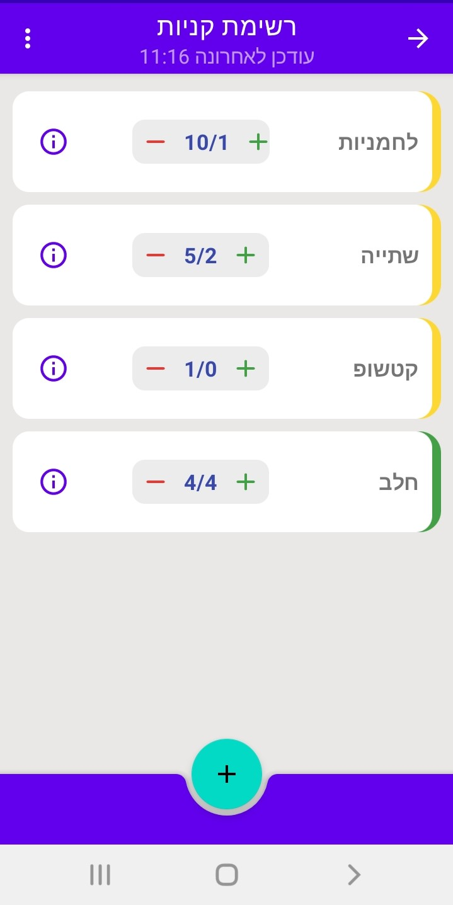
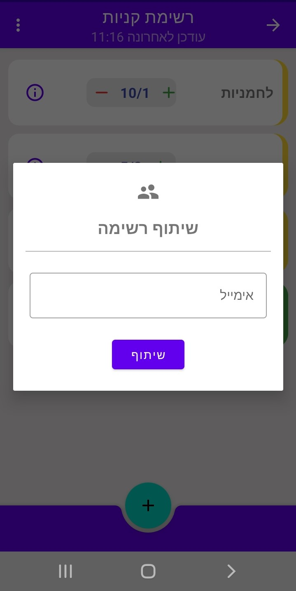
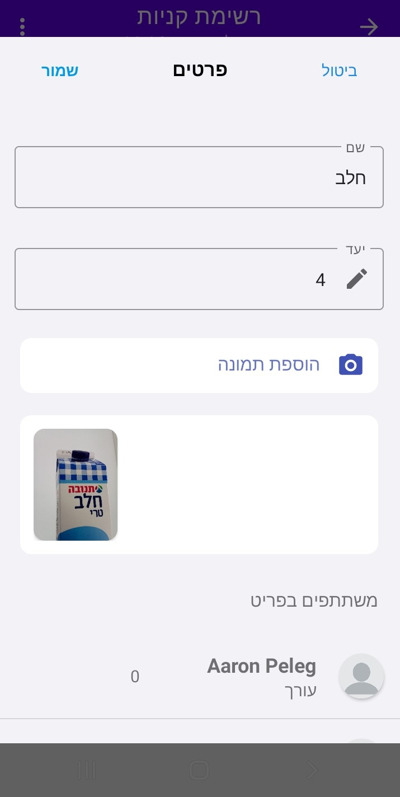
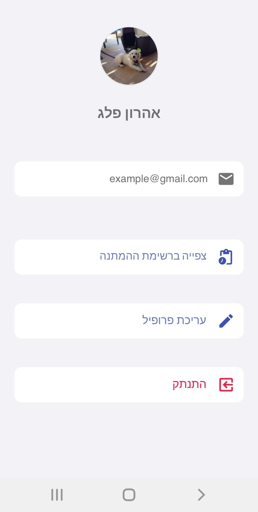
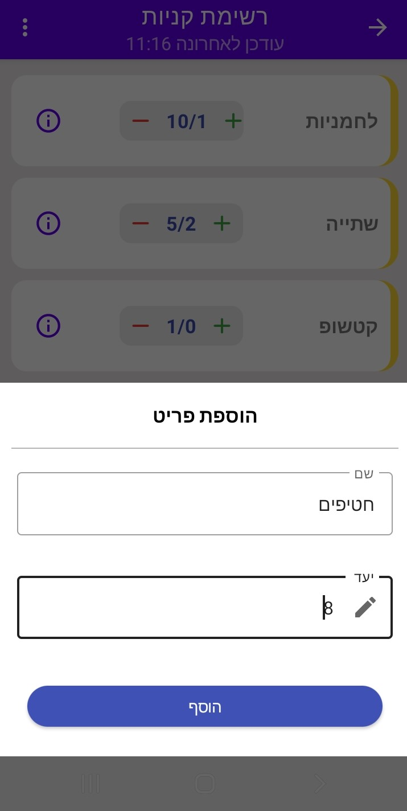

# Share4Target - List Collaboration

  

## 📌 About the Project
Share4Target is a collaborative list-sharing application designed to make organizing group events easier. Unlike other list apps, Share4Target allows users to join a shared list and choose how many items they will bring.

For example, when planning a picnic with friends, each participant can join the list and specify how many of each item they will bring—making coordination seamless and efficient.

## 🚀 Features
- **Create & Share Lists** – Easily generate lists and invite others to collaborate.
- **Item Contribution Tracking** – Users can select how many of each item they will bring.
- **Google Authentication** – Secure login powered by Firebase Authentication.
- **Cloud Storage** – Firebase Firestore ensures real-time updates and synchronization.

## 🛠 Tech Stack
- **Android (Java)** – The app is built using native Android development in Java.
- **Firebase** – Used for authentication and real-time cloud storage.

## 📷 Screenshots

  

  
  
  
  
  

---
Stay tuned for updates and improvements! 🚀

